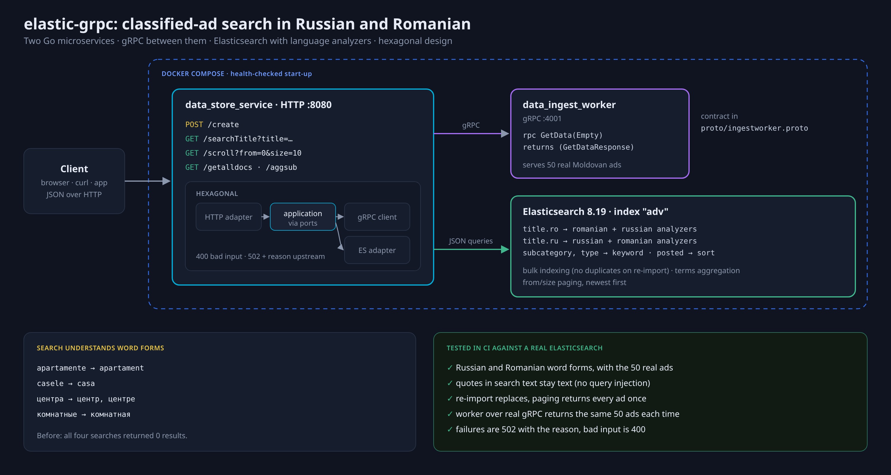
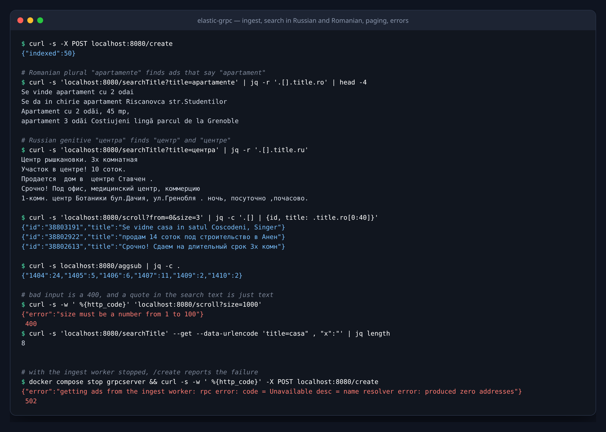
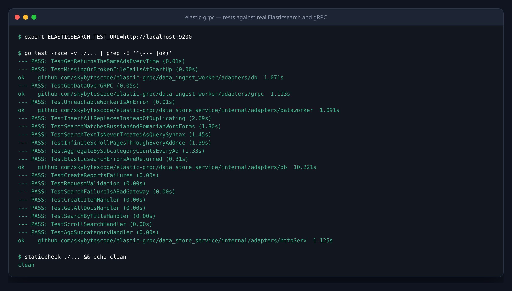
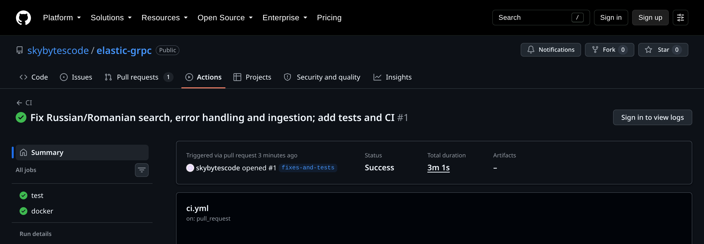

# elastic-grpc

[](https://github.com/skybytescode/elastic-grpc/actions/workflows/ci.yml)

Two Go microservices that load classified ads into Elasticsearch and search
them in **Russian and Romanian**, the two languages Moldovan ads are written
in:

- **data_ingest_worker**: a gRPC server (`:4001`) that serves the ads.
- **data_store_service**: an HTTP API (`:8080`) that pulls the ads from the
  worker over gRPC, bulk-indexes them into Elasticsearch, and offers
  full-text search, pagination and aggregations.



Both follow a hexagonal layout: the application core depends on ports
(interfaces), and adapters (gRPC, HTTP, Elasticsearch) implement them.

## Run it

```bash
docker compose up --build
curl -X POST localhost:8080/create          # worker -> Elasticsearch: {"indexed": 50}
curl 'localhost:8080/searchTitle?title=apartamente'
```



| Endpoint | Returns |
|---|---|
| `POST /create` | Pulls the ads from the worker and bulk-indexes them; importing again replaces, never duplicates |
| `GET /searchTitle?title=…` | Ads whose title matches in Russian or Romanian, best match first |
| `GET /scroll?from=0&size=10` | A page of ads, newest first (`size` 1–100) |
| `GET /getalldocs` | All ads, newest first |
| `GET /aggsub` | Number of ads per subcategory |

Errors are JSON: `400` for invalid parameters, `502` with the reason when
Elasticsearch or the worker fails.

### Search that understands word forms

Each title is analysed with Elasticsearch's built-in Romanian **and** Russian
analyzers, whichever field it is in (many "Romanian" titles are written in
Russian). So searching a different form of a word still finds the ad:

| Search | Finds titles containing |
|---|---|
| `apartamente` | apartament |
| `casele` | casa |
| `центра` | центр, центре |
| `комнатные` | комнатная |

The search text is always sent as a JSON value, never spliced into the
query, so quotes and other special characters are just text.

## Configuration

| Variable | Service | Default |
|---|---|---|
| `APPLICATION_PORT` | both | `4001` / `8080` |
| `DATA_FILE` | worker | `adapters/db/data.json` |
| `DATA_INGEST_WORKER_URL` | store | `localhost:4001` |
| `ELASTICSEARCH_URL` | store | `http://localhost:9200` |
| `ELASTICSEARCH_USERNAME`, `ELASTICSEARCH_PASSWORD` | store | unset |

The defaults work for running the services from their folders with
`make run` against a local Elasticsearch; `docker-compose.yml` sets the
container addresses.

## Tests

```bash
go test -race ./...                                     # unit and gRPC tests
docker run -d -p 9200:9200 -e discovery.type=single-node \
  -e xpack.security.enabled=false elasticsearch:8.19.22
ELASTICSEARCH_TEST_URL=http://localhost:9200 go test -race ./...   # + Elasticsearch
```

- **Elasticsearch integration tests** use the 50 real ads, each in its own
  throwaway index: Russian and Romanian word forms, hostile search text,
  re-importing without duplicates, paging through every ad exactly once,
  aggregation counts, and Elasticsearch errors being reported.
- **gRPC test**: the worker served over real gRPC returns the same 50 ads on
  every call.
- **HTTP tests**: handlers with a mock application, including validation and
  failure responses.

[GitHub Actions](.github/workflows/ci.yml) runs gofmt, `go vet`, staticcheck
and every test, including the integration tests against an Elasticsearch
service container, and builds both Docker images.

| | |
|---|---|
|  |  |

## The gRPC contract

[`proto/ingestworker.proto`](proto/ingestworker.proto), with the generated
Go code in [`proto/ingestworker`](proto/ingestworker). Regenerate with
`make proto`.

## History

The first version (2024) had the architecture, the endpoints and the HTTP
handler tests. This version fixes what the new tests and a closer look found:

| Bug | Effect |
|---|---|
| Titles were indexed with the standard analyzer | "Russian and Romanian morphology" did not work: "apartamente" and "центра" found nothing |
| The search text was spliced into the query JSON | A quote broke the query or changed its structure |
| Handlers replied 200 "data successfully transferred" after errors; Elasticsearch error statuses were ignored | Failures looked like success |
| Inserts were one request per ad with errors ignored | Slow, silent data loss |
| The worker appended its file on every request | 50, then 100, then 150 ads |
| A nil-pointer dereference when the worker was unreachable | The store service crashed |
| Docker vs. local addresses were switched by editing code | Not configurable |
| The proto contract lived in a repository under a previous account name | Fragile build |
